

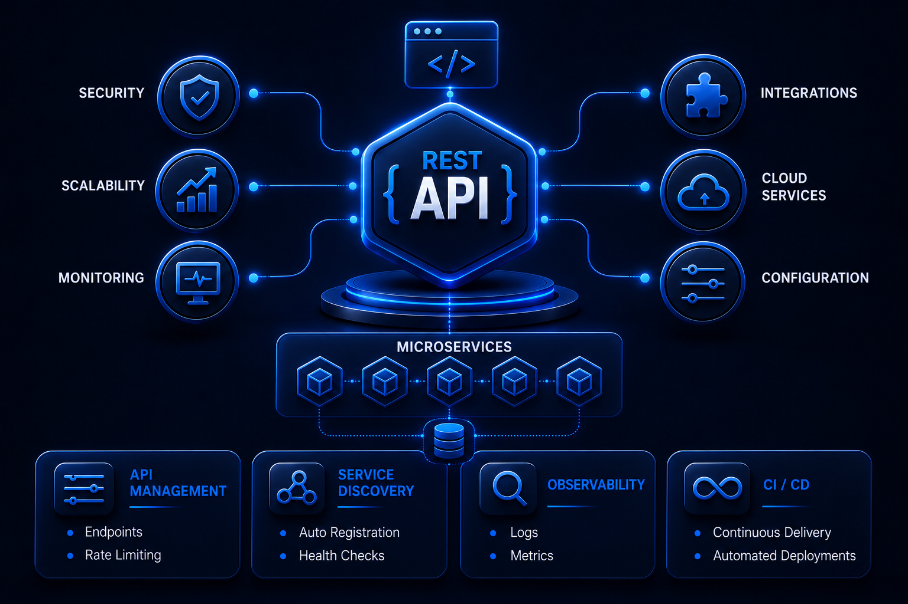

 

    
    

##  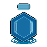  Api-Rest & Microservices

 

Central repository for Rest API and Microservices type backend projects.

 

 * Languages : Java, Javascript, Typescript, others.
 * Frameworks : Spring Framework, Serverless, Prometheus, Express, Nestjs, others.
 * Spring modules : Spring Boot, Spring Cloud, Spring Data JPA, others.
 * AWS Services : Lambda, S3, SQS, SNS, RDS, Api Gateway, DynamoDB, others.
 * Technologies : Nodejs, others.
 * ORM : Sequelize, TypeORM,  others.
 * Databases : MySQL, PostgreSQL, DynamoDB, SQLite, others.
 * Libraries : Resilience4J, Lombok, dotenv, cors, aws-sdk-v3, nodemon, express-validator, others.
 * Tools : Grafana, VSC, Postman, Maven, nodemon, swagger, Git, others.
 * Testing : Jest, Supertest, Mocha & Chai, others.

  
 
  

<!------Start Index----->

## Index 📜

 
 See 

  

#### 🗂️ Projects

* [BGVault AES-256-GCM Credential Manager ](#bgvault-aes-256-gcm-credential-manager--)

  

    
    
    
    
    
    
    
  

* [Api Rest about microelectronic devices ](#api-rest-about-microelectronic-devices--)

  

    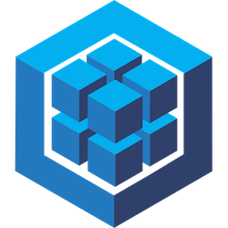
    
    
    
    
    
    
    
  

* [Api Rest for the statistical management of bioethanol ](#api-rest-for-the-statistical-management-of-bioethanol-production-and-sales--)
  
  

    
    
    
    
    
    
    
    
  
     

* [Real estate microservices ](#real-estate-microservices--)
  
  

    
    
    
     
      
    
     
     
     
      
    
  
 

* [Microservice for mercado libre users management ](#microservice-for-mercado-libre-users-management--)
  
  

    
    
    
    
    
    
    
    
  
   

* [Collaboration on a Project on Covid-19 Core/Api-Rest ](#collaboration-on-a-project-on-covid-19-coreapi-rest--)

  

    
    
    
     
    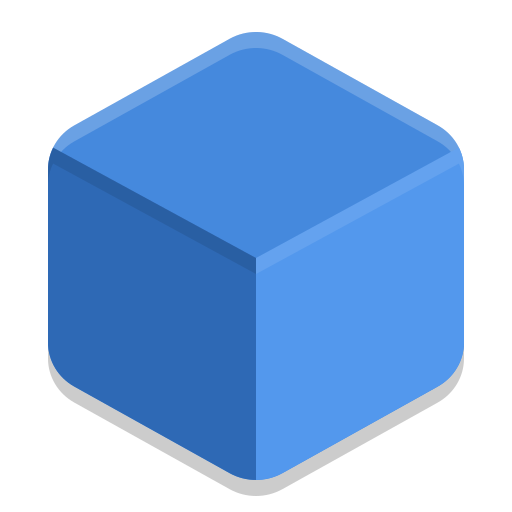 
  
   
  
* [Microservice OpenWeather ](#microservice-openweather--)

   

    
    
    
    
    
    
    
  

* [Microservice Paypal Orders](#microservice-paypal-orders-)

   

    
    
    
    
    
    
  
  

* [API Rest orders and shipments ](#api-rest-orders-and-shipments-)

   

    
    
    
    
    
    
    
    
    
  
 

* [Api Rest about Generic Electronic Products ](#api-rest-about-generic-electronic-products-)

   

    
    
    
    
     
     
      
  
  

* [Api Rest for the management of Microcomponents ](#api-rest-for-the-management-of-microcomponents-)

   

    
    
     
    
    
    
     
     
  
 

* [Centralized Version Control System ](#centralized-version-control-system-)

   

    
    
    
    
    
  
  

* [Microservice for Employee management ](#microservice-for-employee-management-)

   

    
    
    
    
    
    
  
  

* [ Microservice supermarket products ](#microservice-supermarket-products-)

   

     
    
    
    
    
    
     
     
  
 

* [ Api Rest microelectronics Oracle ](#api-rest-microelectronics-oracle-)

   

    
    
     
    
    
     
     
  
   

* [ Api Rest ElectroThings v1 ](#api-rest-electrothings-v1-)

   

    
    
    
    
     
    
    
      
  
 

* [ Api Rest Productos Agrícolas ](#api-rest-productos-agrícolas-)

   

    
    
    
    
    
     
  
                   

 

<!------Stop Index----->
  
 
  

    
 ## 🗂️ Projects

 

<!------BGVault-Crypto-AES-256-GCM------>

  
### BGVault AES-256-GCM Credential Manager 
 

  

    
    
    
    
    
    
    
  

 ### Details

<!------END BGVault-Crypto-AES-256-GCM------>

 
 
 
 
 
 

 
<!------ApiRest_Electronic_Devices_ExpressJS------>
 

  
### Api Rest about microelectronic devices 
 
<a href="https://github.com/andresWeitzel/ApiRest_Electronic_Devices_ExpressJS" target="_blank">
  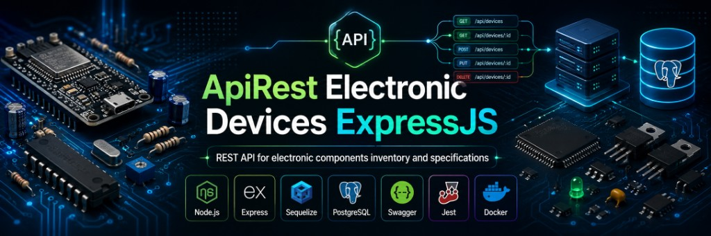
</a>
  

    
    
    
    
    
    
    
    
  

 ### Details

<!------END ApiRest_Electronic_Devices_ExpressJS------>

 
 
 
 
 
 
 

 
 <!------START API_BIOETANOL_DYNAMO------>
 

  
### Api Rest for the statistical management of bioethanol production and sales 

  <a href="https://github.com/andresWeitzel/Api_Bioetanol_Estadisticas_DynamoDB_AWS" target="_blank">
  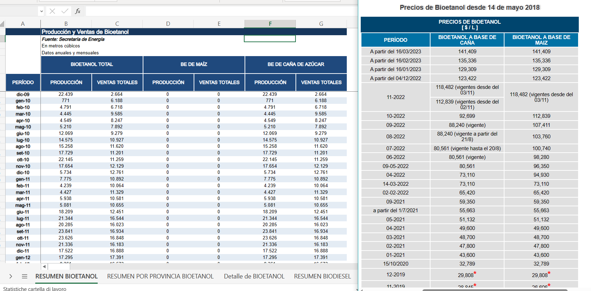
  </a>
  

  
  
  
  
  
  
  
  
  
  
  
  

 ### Details

  

<!------END API_BIOETANOL_DYNAMO------>

 
 
 
 
 
 

<!------SPRING CLOUD REAL ESTATE MICROSERVICES------>

  
  ### Real Estate Microservices 

  
   <a href="https://github.com/andresWeitzel/Microservicios_Spring_Cloud_Netflix_Spring_Boot" target="_blank">
  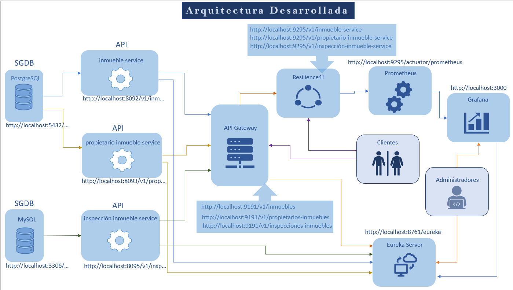
   </a>

 

    
    
    
    
     
      
    
     
     
     
      
    

   

 ### Details

<!------END SPRING CLOUD REAL ESTATE MICROSERVICES------>

 
 
 
 
 
 

 <!------MICROSERVICIO USUARIOS ML AWS------>
 

  
### Microservice for mercado libre users management 

  <a href="https://github.com/andresWeitzel/Microservice_Mercadolibre_Users_AWS" target="_blank">
  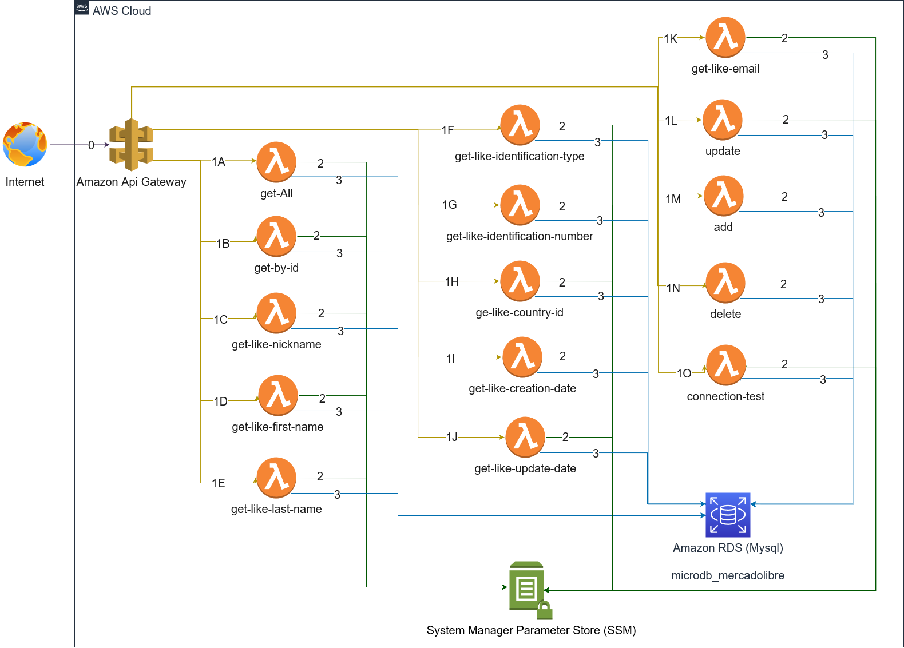
  </a>
  

    
    
    
    
    
    
    
    
    
    
    
  

 ### Details

  

<!------FIN MICROSERVICIO USUARIOS ML AWS------>

 
 
 
 
 
 

 <!------ START COVID-19 CORE API REST ------>  
 

  ### Collaboration on a Project on Covid-19 Core/Api-Rest 

<a href="https://github.com/andresWeitzel/medmask" target="_blank">
 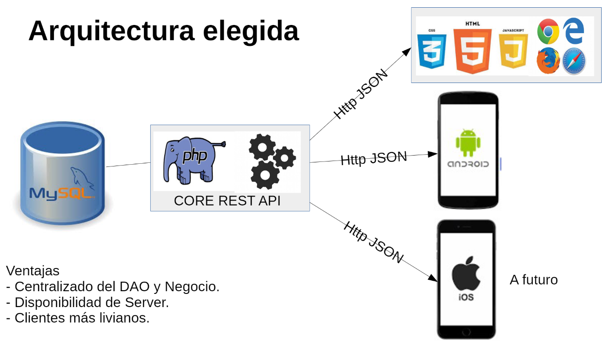
</a>

    
    
    
     
     

 

 ### Details

  

 <!------ END COVID-19 CORE API REST ------>  

  

 
 
 
 
 
 
  
<!------Microservice OpenWeather Nodejs Jest ------>
  

### Microservice OpenWeather 
    
  <a href="https://github.com/andresWeitzel/Microservice_OpenWeather_Nodejs_Jest_AWS" target="_blank">
  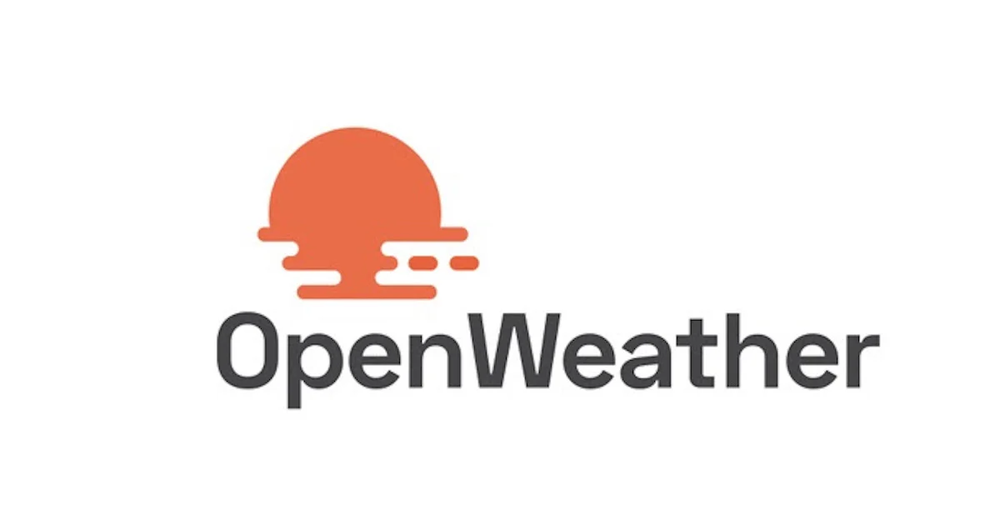
  </a>

  

  
  
  
  
  
  
  

 

 ### Details

  
<!------FIN Microservice OpenWeather Nodejs Jest ------>

 
 
 
 
 
 
  
<!------ Microservice_Paypal_Orders_Express ------>
  

### Microservice Paypal Orders
    
  <a href="https://github.com/andresWeitzel/Microservice_Paypal_Orders_Express" target="_blank">
  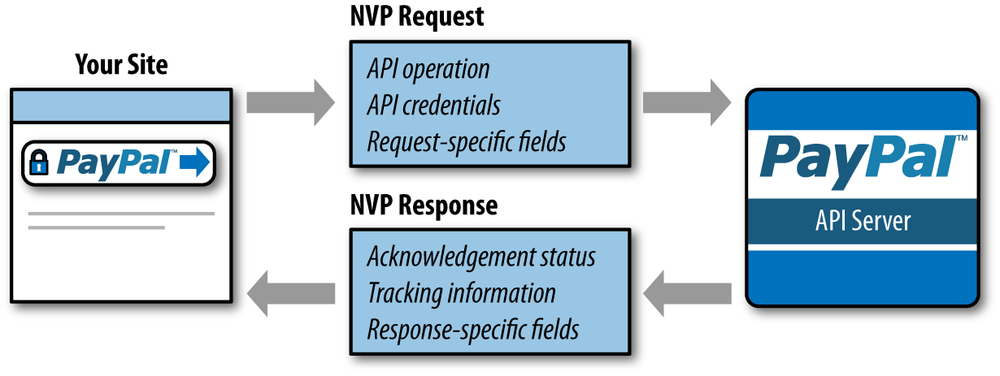
  </a> 

  

    
    
    
    
    
    
  

   

 ### Details

  
  
<!------FIN Microservice_Paypal_Orders_Express ------>

 
 
 
 
 
 

<!------ApiRest_PedidosYaEnvios_NestJS------>
 

  
### API Rest orders and shipments
 
   

  

    
    
    
    
    
    
    
    
    
  

   

 ### Details

  

<!------END ApiRest_PedidosYaEnvios_NestJS------>

 
 
 
 
 
 

<!------ Start Api_Rest_Spring_Productos ------>  
 

     
  ### Api Rest about Generic Electronic Products

<a href="https://github.com/andresWeitzel/Api_Rest_Spring_Productos" target="_blank">
 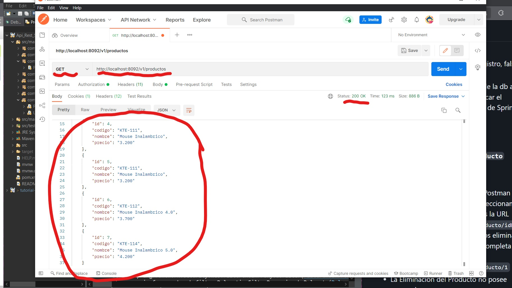
</a>

   

    
    
    
    
     
     
      
  
  

   

 ### Details

  

 <!------ End Api_Rest_Spring_Productos ------>  
 

  
 
 
 
 
 
 

<!------ApiRest_Microcomponents_SpringBoot_Oracle------>

  ### Api Rest for the management of Microcomponents

   <a href="https://github.com/andresWeitzel/ApiRest_Microcomponentes_SpringBoot" target="_blank">
   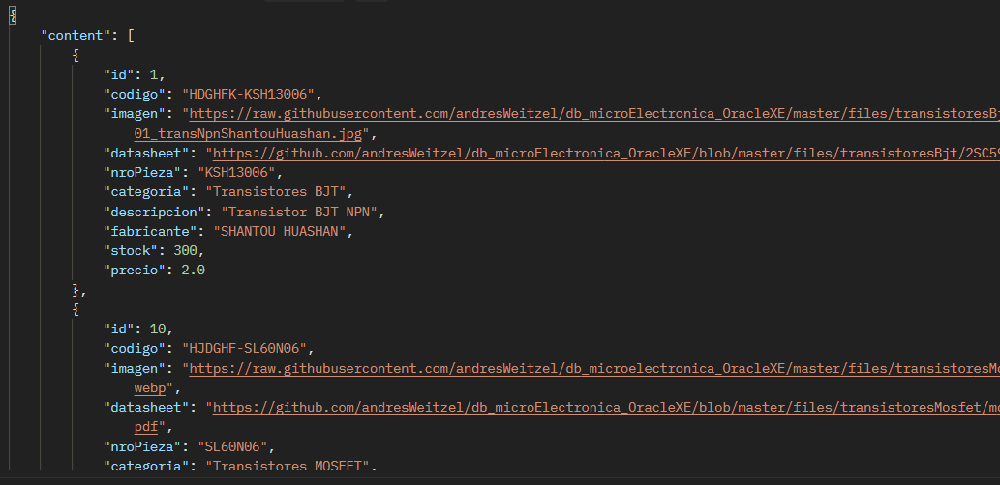
   </a>

  

    
    
     
    
    
    
     
     
  
  

 

 ### Details

  

<!------End ApiRest_Microcomponentes_SpringBoot_Oracle------>

 
 
 
 
 
 
  
<!------ Centralized Version Control System Nodejs ------>
  

### Centralized Version Control System
    
  <a href="https://github.com/andresWeitzel/Centralized_Version_Control_System_V1_Nodejs" target="_blank">
  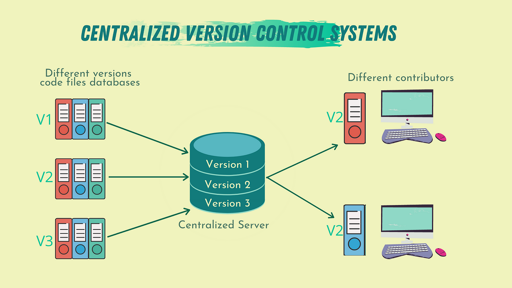
  </a>

  

    
    
    
    
    
  
 

 

 ### Details

   

  
<!------FIN Centralized Version Control System Nodejs ------>

 
 
 
 
 
 

<!------Microservice_Employees_NestJS  ------>
  

### Microservice for Employee management
    
  <a href="https://github.com/andresWeitzel/Microservice_Employees_NestJS" target="_blank">
  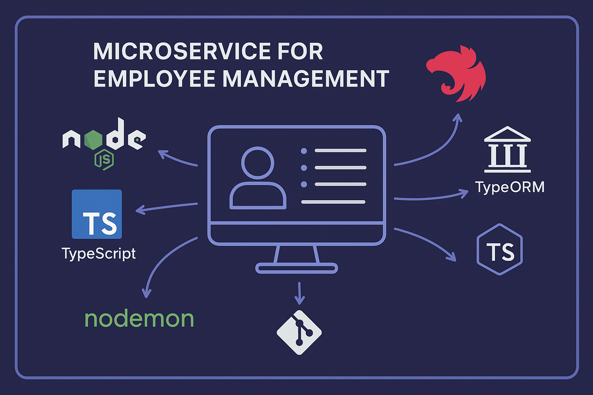
  </a> 

   

    
    
    
    
    
    
  
  

 

 ### Details

   

<!------FIN Microservice_Employees_NestJS   ------>

 
 
 
 
 
 
    

<!------Start Microservicio_ProductosSupermercado------>
  

### Microservice supermarket products

<a href="https://github.com/andresWeitzel/Microservicio_ProductosSupermercado" target="_blank">
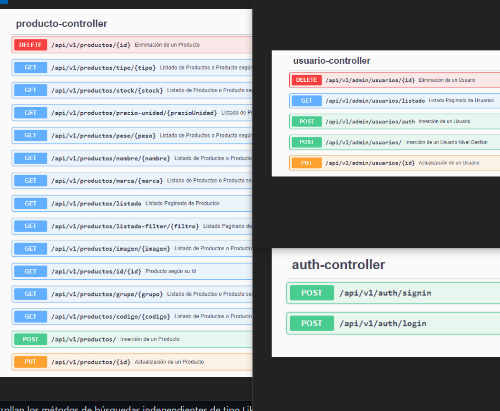
</a>

  

     
    
    
    
    
    
     
     
  
  

 

 ### Details

   

<!------End Microservicio_ProductosSupermercado------>
  
 
 
 
 
 
 

<!------Start ApiRest_Microelectronica_SpringBoot_Oracle------>
 

### Api Rest microelectronics Oracle

<a href="https://github.com/andresWeitzel/ApiRest_Microelectronica_SpringBoot_Oracle" target="_blank">
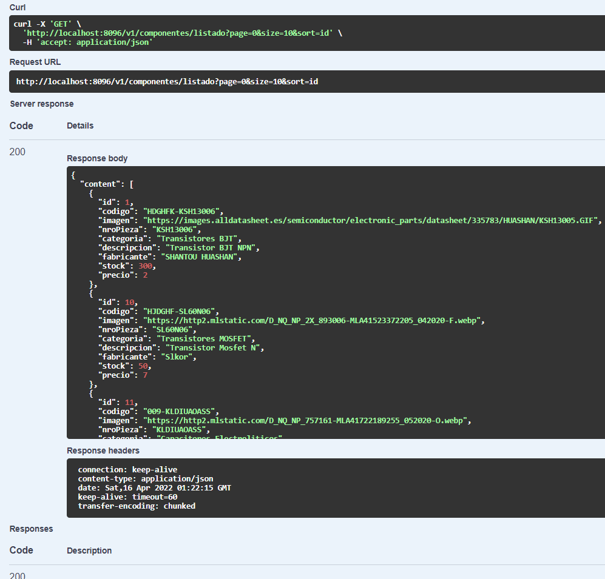
</a>

  

    
    
     
    
    
     
     
  
  

 

 ### Details

   

 <!------End ApiRest_Microelectronica_SpringBoot_Oracle------>  

 
 
 
 
 
 

<!------Start ApiRest_ElectroThingsV1_SpringBoot_MongoDB------>  

### Api Rest ElectroThings v1

<a href="https://github.com/andresWeitzel/ApiRest_ElectroThingsV1_SpringBoot_MongoDB" target="_blank">
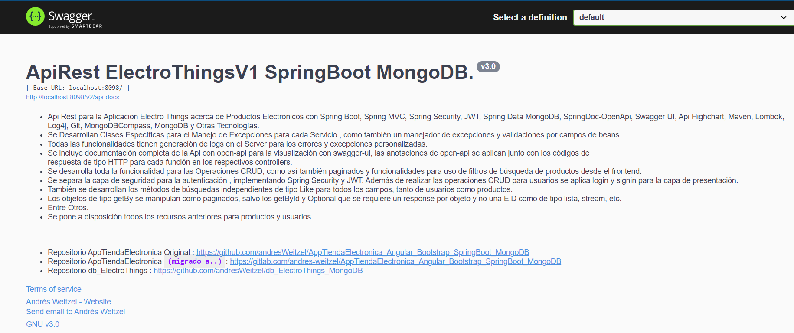
</a>

  

    
    
    
    
     
    
    
      
  
  

 

 ### Details

   

<!------End ApiRest_ElectroThingsV1_SpringBoot_MongoDB------>  

 
 
 
 
 
 

<!------Start ApiRest_ProductosAgricolas_NodeJs------>  

### Api Rest Productos Agrícolas

<a href="https://github.com/andresWeitzel/ApiRest_ProductosAgricolas_NodeJs" target="_blank">
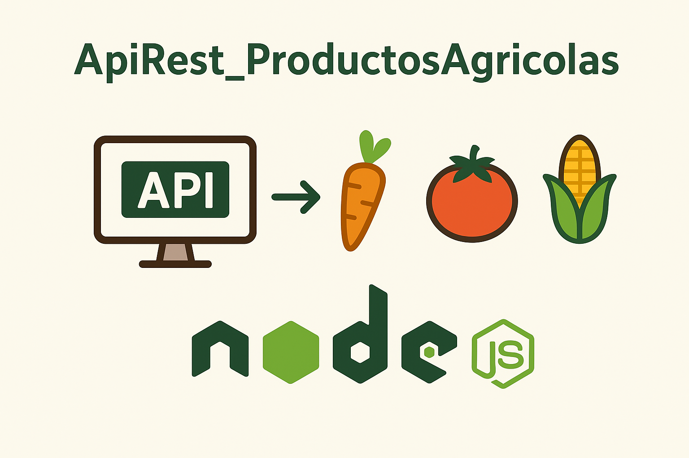
</a>

  

    
    
    
    
    
     
  
  

 

 ### Details

   

<!------End ApiRest_ProductosAgricolas_NodeJs------>  
