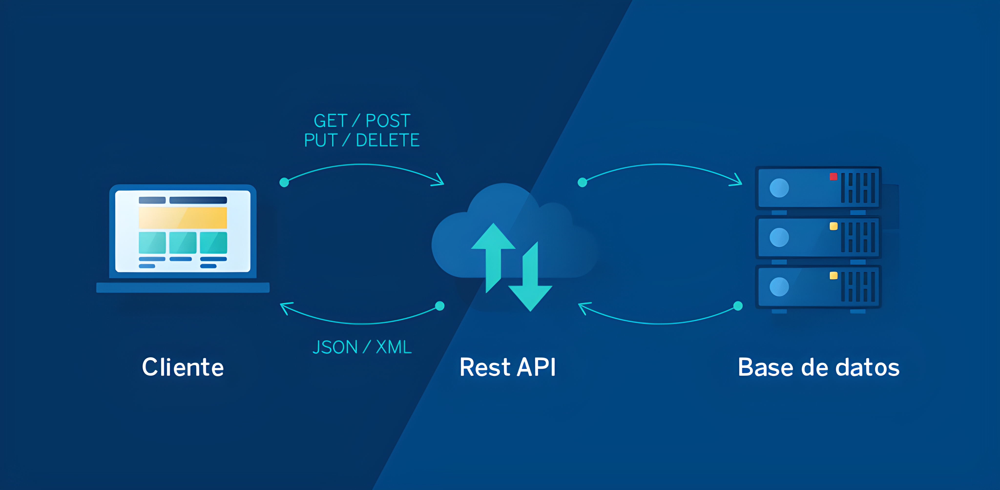
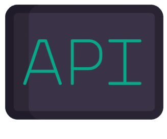
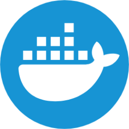

 

     
    

##    Api-Rest & Microservicios

 

Repositorio central para proyectos backend tipo Rest API y Microservicios. 

 

  * Lenguajes: Java, Javascript, Typecript, otros.
  * Frameworks: Spring Framework, Serverless, Prometheus, Express, Nestjs, otros.
  * Módulos Spring: Spring Boot, Spring Cloud, Spring Data JPA, otros.
  * Servicios AWS: Lambda, S3, SQS, SNS, RDS, Api Gateway, DynamoDB, otros.
  * Tecnologías: Nodejs, otras.
  * ORM: Sequelize, TypeORM, otros.
  * Bases de datos: MySQL, PostgreSQL, DynamoDB, otras.
  * Bibliotecas: Resilience4J, Lombok, dotenv, cors, aws-sdk-v3, nodemon, express-validator, otras.
  * Herramientas: Grafana, VSC, Postman, Maven, nodemon, swagger, Git, otras.
  * Testing: Jest, Supertest, Mocha y Chai.

   
 
   

<!------Start índice----->

## Índice 📜

  
 Ver 

  

#### 🗂️ Projects

 

* [Api Rest sobre dispositivos electrónicos ](#api-rest-sobre-dispositivos-electronicos--)

  

    
    
    
    
    
    
    
    
  

* [Api Rest para la gestión estadística de bioetanol ](#api-rest-para-la-gestion-estadistica-de-bioetanol--)
  
  

    
    
    
    
    
    
    
    
  
    

* [Microservicios sector inmobiliario ](#microservicios-sector-inmobiliario--)
  
  

    
    
    
     
      
    
     
     
     
      
    
  

* [Microservicio para la gestión de usuarios de Mercado Libre ](#microservicio-para-la-gestión-de-usuarios-de-mercado-libre--)
  
  

    
    
    
    
    
    
    
    
  
     

* [Colaboración en un proyecto sobre Covid-19 Core/Api-Rest ](#colaboración-en-un-proyecto-sobre-covid-19-core-api-rest--)

  

    
    
    
     
     
  
  

* [Microservicio OpenWeather](#microservicio-openweather-) 

   

    
    
    
    
    
    
    
  

* [Microservicio Paypal Orders](#microservicio-paypal-orders-)

   

    
    
    
    
    
    
  
  

* [API Rest para la gestión de pedidos y envíos](#api-rest-para-la-gestión-de-pedidos-y-envíos-)

   

    
    
    
    
    
    
    
    
    
  
   

* [Api Rest sobre Productos Electrónicos Genéricos](#api-rest-sobre-productos-electrónicos-genéricos-)

   

    
    
    
    
     
     
      
  
     

* [Api Rest para la gestión de Microcomponentes](#api-rest-para-la-gestión-de-microcomponentes-)

   

    
    
     
    
    
    
     
     
  

* [Sistema de control de versiones centralizado](#sistema-de-control-de-versiones-centralizado-)

   

    
    
    
    
    
  

* [Microservicio para la gestión de empleados](#microservicio-para-la-gestión-de-empleados-)

   

     
     
     
     
     
     
   

* [Microservicio productos supermercado](#microservicio-productos-supermercado-)

   

      
     
     
     
     
     
      
      
   

* [Api Rest microelectrónica Oracle](#api-rest-microelectronica-oracle-)

  

    
    
     
    
    
     
     
  
    

* [Api Rest ElectroThings v1](#api-rest-electrothings-v1-)

   

    
    
    
    
     
    
    
      
  

* [Api Rest Productos Agrícolas](#api-rest-productos-agricolas-)

   

    
    
    
    
    
     
  

 

<!------Stop índice----->
  
 
  

    
 ## 🗂️ Proyectos

 

 
<!------ApiRest_Electronic_Devices_ExpressJS------>
 

  
### Api Rest sobre dispositivos electrónicos  [🔝](#índice-)
 

  

    
    
    
    
    
    
    
    
  

 ### Detalles

  
  

<!------END ApiRest_Electronic_Devices_ExpressJS------>

 
 
 
 
 
 
 

 
 <!------START API_BIOETANOL_DYNAMO------>
 

  
### Api Rest para la gestión estadística de Bioetanol  [🔝](#índice-)

  
  

  
  
  
  
  
  
  
  
  
  
  
  

 ### Detalles

  
  

<!------END API_BIOETANOL_DYNAMO------>

 
 
 
 
 
 

<!------SPRING CLOUD REAL ESTATE MICROSERVICES------>

  
  ### Microservicios sector inmobiliario  [🔝](#índice-)

  
   

 

    
    
    
    
     
      
    
     
     
     
      
    

   

 ### Detalles

  
  

<!------END SPRING CLOUD REAL ESTATE MICROSERVICES------>

 
 
 
 
 
 

  
 <!------MICROSERVICIO USUARIOS ML AWS------>
 

  
### Microservicio para gestión de usuarios de Mercado Libre  [🔝](#índice-)

  
  

    
    
    
    
    
    
    
    
    
    
    
  

 ### Detalles

  
  

  

<!------FIN MICROSERVICIO USUARIOS ML AWS------>

 
 
 
 
 
 

 <!------ START COVID-19 CORE API REST ------>  
 

  ### Colaboración en un proyecto sobre Covid-19 Core/Api-Rest  [🔝](#índice-)

    
    
    
     
     

 

 ### Detalles

  

  

 <!------ END COVID-19 CORE API REST ------>  

  

 
 
 
 
 
 
  
<!------Microservice OpenWeather Nodejs Jest ------>
  

### Microservicio OpenWeather [🔝](#índice-)
    
   

    

  
  
  
  
  
  
  

 

 ### Detalles

  
  

  
<!------FIN Microservice OpenWeather Nodejs Jest ------>

 
 
 
 
 
 
  
<!------ Microservice_Paypal_Orders_Express ------>
  

### Microservicio Paypal Orders [🔝](#índice-)
    
   

  

    
    
    
    
    
    
  

   

 ### Detalles

  
  

  
  
<!------FIN Microservice_Paypal_Orders_Express ------>

 
 
 
 
 
 

<!------ApiRest_PedidosYaEnvios_NestJS------>
 

  
### API Rest para la gestión de pedidos y envíos [🔝](#índice-)
 
   

  

    
    
    
    
    
    
    
    
    
  

   

 ### Detalles

  
  

  

<!------END ApiRest_PedidosYaEnvios_NestJS------>

 
 
 
 
 
 

<!------ Start Api_Rest_Spring_Productos ------>  
 

     
  ### Api Rest sobre Productos Electrónicos Genéricos [🔝](#índice-)

   

    
    
    
    
     
     
      
  
  

   

 ### Detalles

  
  

  

 <!------ End Api_Rest_Spring_Productos ------>  
 

  
 
 
 
 
 
 

<!------ApiRest_Microcomponents_SpringBoot_Oracle------>

  ### Api Rest para la gestión de Microcomponentes [🔝](#índice-)

   

  

    
    
     
    
    
    
     
     
  
  

 

 ### Detalles

  
  

  

<!------End ApiRest_Microcomponentes_SpringBoot_Oracle------>

 
 
 
 
 
 
  
<!------ Centralized Version Control System Nodejs ------>
  

### Sistema de control de versiones centralizado [🔝](#índice-)
    
  

  

    
    
    
    
    
  
 

 

 ### Detalles

  
  

   

  
<!------FIN Centralized Version Control System Nodejs ------>

 
 
 
 
 
 

<!------Microservice_Employees_NestJS  ------>
  

### Microservicio para la gestión de empleados [🔝](#índice-)
    
   

   

    
    
    
    
    
    
  
  

 

 ### Detalles

  
  

   

<!------FIN Microservice_Employees_NestJS   ------>

 
 
 
 
 
 
     
<!------Start Microservice_Supermarket_Products------>
   

### Microservicio productos supermercado [🔝](#índice-)
    
   

   

      
     
     
     
     
     
      
      
   
  

 

 ### Detalles

   
   

   
 
<!------FIN Microservice_Supermarket_Products------>

 
 
 
 
 
 
    

<!------Start ApiRest_Microelectronica_SpringBoot_Oracle------>
 

### Api Rest microelectrónica Oracle [🔝](#índice-)

  

    
    
     
    
    
     
     
  
  

 

 ### Detalles

  
  

   

 <!------End ApiRest_Microelectronica_SpringBoot_Oracle------>  

 
 
 
 
 
 

<!------Start ApiRest_ElectroThingsV1_SpringBoot_MongoDB------>  
 

### Api Rest ElectroThings v1 [🔝](#índice-)

  

    
    
    
    
     
    
    
      
  
  

 

 ### Detalles

  
  

<!------End ApiRest_ElectroThingsV1_SpringBoot_MongoDB------>  

 
 
 
 
 
 

<!------Start ApiRest_ProductosAgricolas_NodeJs------>  

### Api Rest Productos Agrícolas [🔝](#índice-)

  

    
    
    
    
    
     
  
  

 

 ### Detalles

  
  

   

<!------End ApiRest_ProductosAgricolas_NodeJs------>  

 
 
 
 
 
 